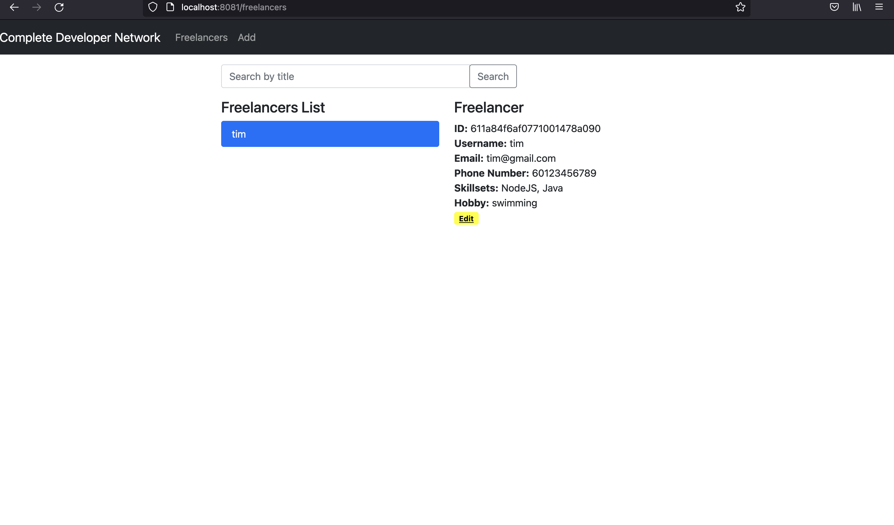

# Getting Started with Create React App

This project was bootstrapped with [Create React App](https://github.com/facebook/create-react-app).

## Available Scripts

In the project directory, you can run:

### `npm start`

NOTE: As data have to be retrieved from the backend, the backend should be started before proceeding the following steps. Furthermore, if backend is started using docker, the frontend connection to backend would not work. Please use the docker-compose instruction in the main page for a fully functioning frontend and backend.

Runs the app in the development mode.\
Open [http://localhost:8081](http://localhost:8081) to view it in the browser.

Alternatively using docker:

1. docker build -t frontend .
2. docker run -it -p 8081:8081 frontend

The page will reload if you make edits.\
You will also see any lint errors in the console.
